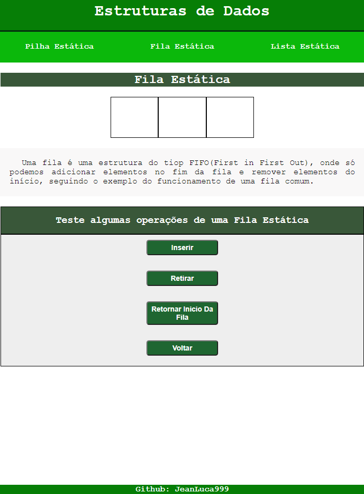

# Estruturas de Dados Simples
 Este site foi construido utilizando **HTML**, **CSS** e **JavaScript** puro para além de treinar estas tecnologias, explicar um pouco sobre o funcionamento de algumas estruturas de dados estáticas.
 
 ***
 
